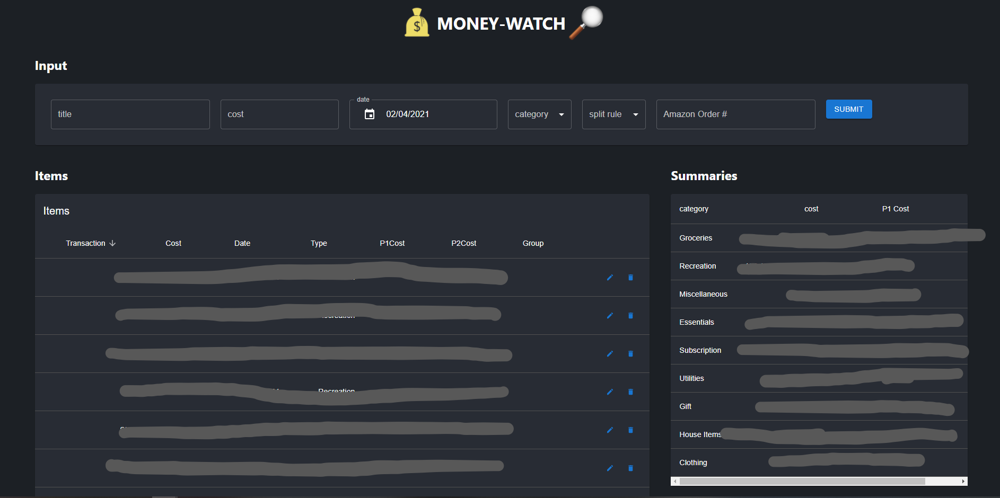

# money-watch
finance management app (WIP)

## Features
- Add transaction items and associate a date + category + split rule (if splitting with at most 1 person) + grouping (called amazonOrder in the app, but it can be generalized to any grouping)
- Edit and delete existing transaction items - dynamically updates lists
- Sort items by any of: transaction name, cost, date, type, etc
- Pagination of transactions
- Shows summary of total cost for all transactions falling under a category
- Shows total costs of transacions in a group
WIP - some features are buggy

## Steps WIP
- go to client, yarn start (launches website at localhost:3000)
- go to server, npm start (launches a server at port 8000)
- need your own firebase cloud firestore keys to use server

